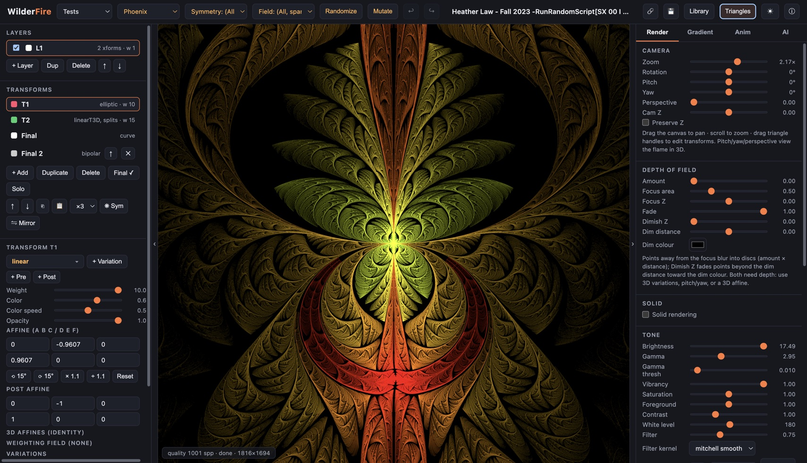

# WilderFire 🔥

A GPU-native fractal flame editor for the browser — a WebGPU reimagining of
[JWildfire](https://github.com/thargor6/JWildfire) / Apophysis / flam3.
Everything runs client-side; nothing ever touches a server.
Live at [wilderfire.fly.dev](https://wilderfire.fly.dev).

Free software under the **LGPL-2.1-or-later** · © 2026 Andre Paquette ·
**pull requests are not accepted** (issues and forks are welcome — see
[CONTRIBUTING.md](CONTRIBUTING.md)).



## Why WebGPU (and no wasm)

The fractal flame algorithm is a chaos game: billions of tiny independent
iterations accumulating into a histogram. That workload is embarrassingly
parallel, so WilderFire compiles **each flame into its own WGSL compute
shader** (variations inlined, parameters in a storage buffer so slider tweaks
never recompile) and runs 65k persistent chaos-game walkers per frame with
atomic histogram accumulation, followed by a flam3-style log-density /
gamma / vibrancy tonemap pass. On a typical discrete GPU this reaches
**hundreds of millions to billions of iterations per second** — orders of
magnitude beyond what a wasm/CPU port could do, which is why there is no wasm
in the stack.

## Features

- **947 variations** — 77 hand-written entries (the flam3 classics, JWildfire's
  `obj_mesh_primitive_wf` — its 26 built-in meshes ship as compact binaries and are
  subdivided/smoothed exactly like JWildfire — `sattractor3D` — a strange attractor
  (21 JWildfire presets or your own x/y/z formulas) swept into a faceted tube on the
  CPU — and `obj_mesh_wf` — your own OBJ
  files, loaded into the browser from the transform editor —, `subflame_wf` — a
  whole flame nested as a variation, compiled into the same GPU kernel —,
  `inversion`, `mobius3D_with_inverse` and `pre_stabilize`) plus **938 JWildfire
  variations ported mechanically**: JWildfire's own GPU snippets and, for
  variations that have none, its Java `transform()` code (attractors, the
  `crop_*` and `glsl_*` shader-art families, `synth`, `nBlur`, `falloff3`,
  the `glynn*` circles, `kifs3d`, `octapol`, `quad`-style objects, per-cell
  seeded `de_stijl`/`greebles`, …), through a CUDA→WGSL transpiler and
  **numerically verified in 3D against headless JWildfire** (913 by the
  per-point oracle, 17 by inspection where statistics cannot compare;
  JWildfire's own GPU≠CPU snippet bugs are patched back to the Java, and
  shader hashes on cell ids run in double-float so cut/worley patterns
  match — see [`scripts/jwf-port/README.md`](scripts/jwf-port/README.md)).
  The 66 JWildfire variations that are *not* implemented are listed with
  their reason in `scripts/jwf-port/data/unportable.json` (user code compiled
  at run time, external content such as sub-flames/images/meshes/SVG/text,
  the remaining CPU-built point sets, …); the importer names the reason when a flame uses one.
  JWildfire's **point-set variations** — `sunflower`, `scrambly`, `dla_wf`, `snowflake_wf`, `klein_group`,
  `grid3d_wf`, `maurer_lines` and the `_js` turtle fractals (`dragon_js`, `koch_js`, `hilbert_js`, `htree_js`,
  `tree_js`, `brownian_js`) — build their primitives on the CPU exactly as JWildfire does (same seeded generators)
  and sample them on the GPU from one storage buffer.
  Parametric controls for every one, JWildfire-style **pre / normal / post
  priority** (per-instance overrides and the *prepost* inverse pairs), several
  chained final transforms per layer, per-transform colour modifiers, weighting
  fields (noise-modulated amounts / params / colour / jitter), and **direct-colour `dc_*` variations** — both the flam3 kind
  that steer the palette coordinate and JWildfire's shader-art kind
  (`dc_hexagons`, `dc_menger`, `dc_voronoise`, …) that paint RGB directly
- **Variation picker** — searchable popover with type chips (2D, 3D, blur,
  DC, pre, post, crop, …) and pinned classics, replacing a 700-entry dropdown
- **3D** — points carry z, every variation stage can read/write depth,
  per-transform **yz / zx affine planes** (+ post), a JWildfire-compatible
  camera (pitch / yaw / bank, perspective, position, `preserve_z`),
  **depth of field** (focus point or focus plane, area, fade) and
  **dimish-z** depth fade; all of it round-trips through `.flame`
- **Solid post-process DOF + bokeh** — solid flames with `cam_dof` blur exactly like
  JWildfire (sharp z-buffer, then `PostDOFCalculator`'s disc scatter over the finished
  image, with `post_bokeh_*` glints), instead of plot-time jitter
- **JWildfire colour and compositing stage** — flame-level `saturation` (an HSL shift
  applied after the background composites in), `fg_opacity` (alpha only), transparent
  background, per-file `oversample`, **post symmetry** (X/Y mirror or rotational copies
  of every plotted point) and **adaptive filtering** (the `MITCHELL_SINEPOW` kernel picks
  a kernel per pixel from the local density and Scharr edge response)
- **Solid rendering** (Render → Solid) — instead of accumulating density, every
  raster cell keeps its nearest point (a GPU z-buffer on the camera depth) and the
  surface is shaded from screen-space normals with up to 4 **distant lights**
  (altitude / azimuth / intensity / colour) and up to 8 **materials** (ambient,
  diffuse, specular + shininess + colour, diffuse falloff curve; a transform can
  carry a material index that blends along the orbit like the colour). The
  JWildfire model ported literally — its shading, its filter-in-raster-cells,
  its coverage alpha — and verified against headless JWildfire on solid flames
  from public collections (mean-luma ratio 1.00–1.03, block MAE ≤ 2, structure
  correlation 1.00), plus **ambient occlusion** from the depth buffer (JWildfire's
  `AOCalculator`: search radius, radius/direction samples, falloff, gaussian
  smoothing — separable on the GPU —, intensity, diffuse influence; verified the
  same way) and **shadow maps** (`ShadowCalculator`: a light-space depth map per
  casting light filled by the chaos game itself, hard or smoothed lookups, bias,
  per-light shadow intensity; verified the same way); `sld_render_*` attributes
  import/export. `obj_mesh_primitive_wf` (ball, box, torus, gears, mandelbulb, …)
  and `obj_mesh_wf` (a Wavefront `.obj` of your own, kept in the browser's mesh
  store under its file name; the default cube until one is chosen) are available
  for solid scenes — the meshes are sampled on the GPU from a face CDF, loaded on
  demand; JWildfire's **background gradients** (2×2 corners,
  optional centre colour) render in both paths; **reflection maps** — an
  environment image per material (Render → Solid → material → ⬆ image; kept in
  the browser's image store under its file name, like meshes), reflected through
  the view direction with JWildfire's Blinn–Newell or spherical mapping and its
  own bilinear rule, verified against headless JWildfire (ratio 1.00, corr 1.00)
- **Layers** (up to 8) — each with its own transforms, final transform,
  gradient, density weight, and visibility, blended in one histogram; walker
  threads are partitioned across layers on the GPU
- **Xaos** (flam3 "chaos") — per-pair transition weight matrix between
  transforms, evaluated natively in the GPU kernel via per-source CDF rows
- **Triangle editor** — drag O/X/Y handles directly on the canvas; pan by
  dragging, zoom with the wheel (raster +y down, like flam3 / Apophysis /
  JWildfire, so imported flames are not mirrored)
- Transform editor: weights, palette color / color-speed / opacity, affine +
  post-affine matrices, optional **final transform**
- **JWildfire-exact tonemap** — the same log-density curve (contrast,
  brightness, white level, low-density glow, gamma threshold, vibrancy),
  the same **density estimation** (`de_radius` / `de_curve` similar-density
  gather; the live preview caps its radius, exports use it in full),
  **spatial filter** (all 18 JWildfire kernels — Mitchell, Gaussian, the
  SinePow family, Lanczos, Catmull-Rom, …) and antialias jitter, verified
  pixel-for-pixel against headless JWildfire on synthetic flames and by
  whole-image metrics on the bundled samples and presets (`scripts/jwf-port`
  compare harness); two-pass tonemap so filtering is free; plus **2× oversampling**. The
  randomizer uses JWildfire's brightness 4 / gamma 4 baseline
- **Undo/redo** with slider-gesture coalescing (Ctrl/Cmd+Z, Shift+Ctrl/Cmd+Z)
- **Animation** — capture keyframes, morph between them (structure-merging
  interpolation that keeps the GPU kernel hot within each segment;
  **rotation-aware affine morphing** so spins rotate instead of collapsing),
  live looping playback with scrubbing, per-keyframe easing
  (linear/smooth/in/out), timeline save/load, and **WebM (VP9) or MP4 (H.264)
  export** rendered client-side via WebCodecs — at canvas size or a fixed
  720p / 1080p / 1440p / 4K frame (offscreen, tiled); the batch export
  queue can render the animation at several sizes/formats alongside stills
- **Motion curves** — animate any numeric parameter (camera, DOF, tone,
  transform weight/color/affine, any variation weight or parameter) with
  (time, value) keys and Catmull-Rom / linear / smooth / step interpolation,
  layered on top of the keyframe morphs; **drag points on the graph**
  (double-click adds, Alt-click removes), editable point table, persisted
  with the timeline **and written into `.flame` files in JWildfire's
  `*Curve_*` format** (JWildfire animates them; its curves import back)
- **Pre/post variation stages** per transform — weighted variation lists
  evaluated before and after the main sum (include `linear 1` in a stage for a
  pass-through); `pre_*`/`post_*` variation names in imported `.flame` files
  map onto these stages automatically
- **Editor niceties** — reorder transforms (xaos-aware) and layers, copy/paste
  transforms across layers and flames, rotational/mirror **symmetry
  generators**, arrow-key nudging, **collapsible side panes** (`[` / `]`)
- **Animation presets** — on the Anim tab, one click adds seamless-loop motion
  curves: Spin (either way), Zoom pulse, Drift, Orbit and Wobble (3D), Breathe
  (transform weights), Variation sway, Twirl (each transform rotates about its
  own origin), Julia sweep, Fade in/out — 3–20 s per loop; presets combine, and
  the curves are ordinary ones you can edit afterwards
- **Gradient from an image** — 🖼 From image… on the Gradient tab (or drop a
  photo on the canvas) turns a picture into the active layer's gradient:
  JWildfire's median-cut quantizer, 256 colours sorted by hue then brightness
- **Random flame styles** — the style select next to 🎲 Randomize offers
  JWildfire's own generators, transcribed: Bubbles, Julians, Splits, Spherical,
  Ghosts, Tentacle, Linear, Sierpinsky, Galaxies, Machine, Brokat, Spirals,
  Phoenix, Julian disc, Julian rings, Xenomorph, Outlines, Duality — or "Any",
  which picks one at random like JWildfire's "All"; the WilderFire randomizer
  stays as its own entry
- **Share links** — 🔗 in the header copies a link that opens the flame in
  WilderFire; the flame's `.flame` XML is deflated into the URL hash, so nothing
  is uploaded and the link works offline (a typical flame is ~2 KB of URL)
- **The flame travels in the PNG** — every PNG WilderFire saves (Save PNG,
  hi-res, batch, the assistant's export) carries its `.flame` XML in a
  `flam3_genome` text chunk, flam3's own convention; drop such a PNG on the
  canvas (or ⬆ Load it) and the flame comes back, motion curves included. A
  pack's plain preview PNGs in a folder drop are skipped quietly
- **Gallery mode** — ▶ Gallery in the library turns the search result into a
  fullscreen slideshow rendered live (quality cap 100–1000 spp, your choice):
  ← → browse, Page Up/Down ±10, Space auto-advances (3–40 s), F browser
  fullscreen, Esc leaves with the shown flame loaded; the name and provenance
  sit in a caption that fades with the controls when the mouse is still
- **AI assistant that acts** — with tools on (default), the model works through
  function calls: `apply_edits`, `set_camera`, `screenshot`, `variation_lookup`,
  `library_search` / `library_similar` / `library_load` / `library_save`, `randomize`,
  `mutate`, `undo`, `redo`, `share_link`, `export_png` (asks first), and
  `get_engine` / `set_engine` for the live-render engine — quality cap,
  Stop-after, Draft/Final mode, speed, oversampling, DE preview, preview
  hold, adaptive budget, pause, re-render, reset — driving the Render tab's
  own controls — it sees each result, and the render when
  screenshots are on, and iterates up to 8 rounds before answering; a Stop button
  aborts. A status line under the context controls says whether the next
  request carries tools and, if not, why (Tools box off, "Edits as" set to
  text only, or a model the OpenRouter catalogue marks as unable to call
  tools — models that can are tagged 🛠 in the picker); an endpoint that
  refuses tools gets the request again without them, and edit commands a
  model writes into its prose instead of calling `apply_edits` are applied
  anyway, with a note. Works with OpenRouter and any local OpenAI-compatible
  server that supports tools
- **Provenance** — library entries remember where a flame came from (the dropped
  file, `zip › entry`, or folder path) and its JWildfire `meta_info_author`; both
  show on the card and are searchable; author/creation time/uuid round-trip
  through `.flame` export
- **Session autosave + flame library** — the working flame and animation
  timeline persist across reloads; a thumbnail library on IndexedDB (no
  practical size limit; an older localStorage library migrates itself;
  thumbnails are stored as binary JPEG blobs, so thousands of entries open in a
  blink) with whole-library JSON export/import for backups and moving between
  browsers, a name/author/source/tag **search**, names in natural order,
  keyboard navigation (arrows, Page Up/Down, Home/End, Enter loads), **Remove
  duplicates** (identical parameters, first instance kept — one pass, not N²)
  and **Empty library** (asks first). The grid is virtualised — only the cards
  in view exist, so a library of thousands opens and scrolls like one of a
  dozen. **Favourites** (★ on the
  card or Space), free-form **tags** (🏷 on the card; "Tag all shown…" tags a
  whole search result in one write) and **collections** — a select listing
  ★ Favourites, every tag and every source pack with counts — that combine with
  the search box; the gallery plays whatever collection is showing.
  **≈ Similar** ("more like this") ranks the library by a structural signature —
  which variations a flame uses and how heavily, its palette's hue histogram,
  transform count, final, 3D, solid — against the selected card or the flame
  in the editor; one O(N) pass, no rendering, so it is instant at thousands
  Hundreds of community packs are at
  [jwfsanctuary.club/downloads/flamepacks](https://www.jwfsanctuary.club/downloads/flamepacks/)
  (their authors' work — check each pack's terms).
  **Drag `.flame` / `.zip` files — several at once, or a whole folder — onto the
  canvas**: one flame loads, more go straight into the library (zips are unpacked
  in the browser; pictures and readmes in a folder are ignored).
  Loading a **flame pack** (a JWildfire `.flame` file holding many flames)
  opens a chooser: load one, or add them all to the library at once — each
  entry gets a thumbnail rendered on the spot
- **Mutation grid** (MutaGen-style) — 3×3 explorer of random mutations
  rendered offscreen; click to adopt and keep exploring
- Progressive refinement with a quality cap and a **wall-clock limit** (Engine →
  Stop after, 30 s by default; whichever comes first ends the live render,
  so a heavy flame never keeps the GPU at full load for minutes), speed
  presets, pause/re-render,
  and a **preview hold** (Engine → Preview hold): after each edit the last
  image stays on screen until the new one has accumulated N samples per
  pixel (a bounded burst of extra passes gets it there within a frame), so
  dragging a triangle never shows the sparse first frames; Draft / Final /
  Custom engine modes; and an **adaptive preview budget** that shrinks the
  work per frame on very heavy flames (many layers × variations) so the
  editor stays responsive — measured from the GPU's own completion time,
  scaled back up when there is headroom, never applied to exports. On a big
  canvas the tonemap pass (density estimation) costs several times the
  chaos game, so the picture is presented no more often than every 2× its
  measured cost while the compute runs every frame at full budget. Engine →
  ↺ Reset puts every engine setting back to its default
- A **gradient library** — the 899 gradients JWildfire ships (the classic
  Apophysis / UltraFractal packs: carr, floral, universe, sky, star), bundled
  as one 0.7 MB file fetched when the library first opens; search by name,
  filter by pack, click to use. Gradient presets, IQ-cosine **random palettes**, hue rotation, a
  **draggable stop editor**, invert, and **.ugr / .map gradient import and
  export** (a .ugr gradient pack opens a chooser)
- **Tests menu: the 33 sample flames bundled with the
  [JWildfire repository](https://github.com/thargor6/JWildfire)**
  (`resources/flames/TINA0001–TINA0033`, © Andreas Maschke, LGPL 2.1+),
  shipped with the app, loaded through the `.flame` importer and verified
  against headless JWildfire renders — plus a curated **randomizer**
- PNG export, **hi-res export** (2-4× screen resolution or 1080p / 1440p /
  4K, optional transparent background) rendered in one piece whenever it fits
  the GPU's buffer budget — up to 8K on a typical discrete GPU; beyond that the
  largest tiles that fit, with an apron so the density filter never seams —, a **batch export queue** (several
  flames from the library × several sizes into a folder, cancellable), flame
  **JSON save/load**, and **.flame XML
  import/export** compatible with flam3 / Apophysis / JWildfire (coefs, chaos,
  color_speed / symmetry, all three palette encodings, `<layer>` blocks,
  3D camera, DOF, dimish-z, tonemap/filter/DE settings, motion curves,
  `cam_zoom` folded into zoom; unsupported variations are skipped and
  reported; the twenty variations whose parameter names contain spaces or
  dots — `glsl_*`, `crop_trapezoid`, `mobius_strip`, `flame_bulb` — are
  written verbatim the way JWildfire writes and reads them, so those files
  are not strict XML, and the importer's lenient pass takes them back).
  Exports open a real **Save as… dialog** where the browser
  supports it (Chrome/Edge), falling back to a download elsewhere, and every
  save ends with a message over the canvas — file name and size, or the
  reason it failed
- **Installable & offline** — a web-app manifest and a build-generated service
  worker precache the app (incl. the variation registry and the sample flames),
  so it opens without a network after the first visit; the page itself is
  network-first, so a new deploy lands on the next load and the status bar
  announces it. Never touches AI requests (OpenRouter or a local server)
- **Dark & light themes**
- **AI assistant** via [OpenRouter.ai](https://openrouter.ai) — bring your own
  key and pick any model from a **live, searchable model picker** (provider
  chips, context length, price, vision support, custom IDs); the model sees
  a compact summary of the current flame (the full JSON only when you choose
  it — the `get_flame` tool follows the same setting) **and a screenshot of
  the current render** (vision
  models can look at the result and iterate — including an optional
  **auto-refine loop** that re-captures the render and self-critiques for up
  to 3 extra rounds), editing the flame live. **Context controls** let you
  trim what is sent (flame as compact summary / full JSON / nothing, palette
  as 8 stops / full, variation catalogue in-use / all / none, screenshot,
  conversation memory) and what comes back (**edit commands** — a few lines
  like `set T2.weight 0.8`, `addvar T1 julian 0.7 power=3` — or complete
  flame JSON, or text only), with a live per-turn token estimate. Edit
  commands pasted *into* the chat — copied from an earlier answer, another
  session, a friend — apply directly without a request, and the parser
  accepts the ways models tend to write them (`layers.0.xforms.3.affine
  [a,b,c,d,e,f]`, `add_xform weight=0.1 variations=blur:1`, …), reporting
  any line it cannot follow; the
  defaults are ~1.6k tokens/turn instead of ~19k, and a **session meter**
  under it shows what the requests actually cost so far — server-reported
  token counts and OpenRouter's USD figure (or list price × tokens). A
  **Critique** button asks the model to judge the flame — composition,
  colour, detail, what holds it back — and to propose 3–5 concrete edits that
  appear as one-click buttons under its answer (nothing changes until you
  click one). An **Explain** button asks
  the model to walk through the current flame — what each transform,
  variation, layer, final transform, palette and camera setting contributes,
  plus a few tweaks to try — in prose, without touching it. Instead of
  OpenRouter you can point the assistant at a **local OpenAI-compatible
  server** (Ollama, LM Studio, llama.cpp, vLLM — base URL + model id, models
  listed from the server, key optional). The key is stored in
  `localStorage` and requests go straight from your browser to OpenRouter.

## Keyboard shortcuts

| key | action |
|---|---|
| `Ctrl/Cmd+Z`, `Shift+Ctrl/Cmd+Z` | undo / redo |
| arrow keys (`Shift` = coarse) | nudge the selected transform (over the canvas; inside a side pane they scroll the pane — click in it first, Page Up/Down, Home/End work too) |
| `[` / `]` | collapse / expand the left / right pane |

## Run it

```bash
npm install
npm run dev      # dev server
npm test         # vitest: motion curves, flame model, .flame round-trips, AI edits, tonemap constants
npm run build    # typecheck + tests + production build in dist/
```

Requires a browser with WebGPU (Chrome/Edge 113+, Safari 18+, Firefox behind
`dom.webgpu.enabled`).

Deploy: the site is static (`dist/`); `fly.toml` + `Dockerfile` serve it via
nginx on Fly.io with `fly deploy`.

## Architecture

```
src/
  core/       flame model (flame.ts), variation registry (variations.ts:
              hand-written WGSL + generated variations.jwf.ts ports, the
              latter a lazily loaded, separately cached ~300 KB gz chunk),
              palettes, presets, randomizer, .flame XML I/O (flameXML.ts),
              keyframe morphing (animate.ts), motion curves (motion.ts),
              library store (libraryStore.ts), meshes + the sattractor3D
              formula evaluator and tube builder (meshes.ts, formula.ts,
              sattractor.ts), similarity, share links, PNG metadata
  gpu/        codegen.ts  — flame → WGSL compute kernel + data layout
              renderer.ts — WebGPU pipelines, atomic histogram, tonemap, camera
  ui/         panels (transforms, render, gradient, anim, AI), triangle
              overlay, variation + model pickers, library, mutation grid
  ai/         OpenRouter streaming chat client + model catalogue
  dev/        browser harnesses (variation oracle diff, fixture-flame compile)
tests/        vitest unit tests (run in CI on every push)
scripts/
  jwf-port/   CUDA→WGSL transpiler, JWildfire oracle, generator (README inside)
```

The flame → shader compiler emits a fixed data layout (CDF of xform weights,
then per-xform blocks: affine, post, color, then variation weights/params), so
numeric edits are a single `writeBuffer` and only *structural* edits (adding
variations/transforms) trigger a pipeline rebuild. Motion curves and keyframe
morphs only touch numbers, so playback never recompiles within a segment.

## Licence and copyright

Copyright © 2026 Andre Paquette. WilderFire is free software, released under
the [GNU Lesser General Public License v2.1 or later](LICENSE). Large parts
of it (the ported variations, the GPU helper library, the sample and fixture
flames) are derived from [JWildfire](https://github.com/thargor6/JWildfire)
(© Andreas Maschke and contributors, LGPL-2.1-or-later), which is why the
whole project carries that licence rather than a permissive one. The full
list of third-party material is in [NOTICE.md](NOTICE.md).

## Contributing

**Pull requests are not accepted** and are closed automatically. Bug reports,
fidelity gaps (a `.flame` that renders differently than in flam3 / Apophysis /
JWildfire) and feature ideas are welcome as issues; forks are welcome under
the licence. Details in [CONTRIBUTING.md](CONTRIBUTING.md).
